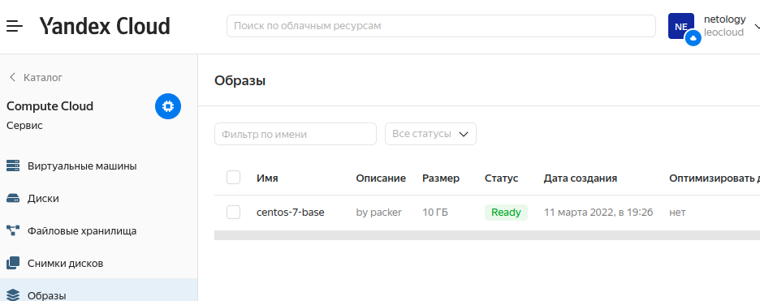

## 05-virt-04-docker-compose.
### ДЗ. "5.4. Оркестрация группой Docker контейнеров на примере Docker Compose".
---
## Задача 1
Создать собственный образ операционной системы с помощью Packer.

Для получения зачета, вам необходимо предоставить:
- Скриншот страницы, как на слайде из презентации (слайд 37).

### Ответ:

  

---

## Задача 2

Создать вашу первую виртуальную машину в Яндекс.Облаке.

### Ответ:

  

---
## Задача 3

Создать ваш первый готовый к боевой эксплуатации компонент мониторинга, состоящий из стека микросервисов.

### Ответ:
- Скриншот работающего веб-интерфейса Grafana с текущими метриками:

  

---
