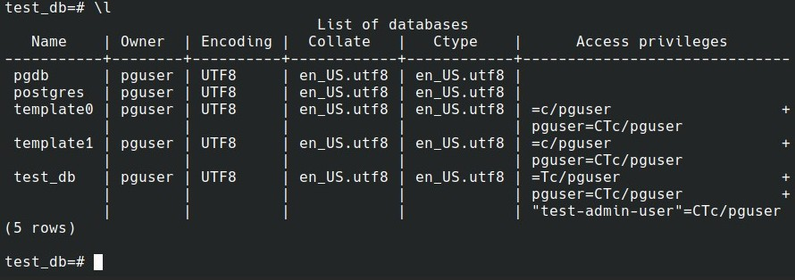
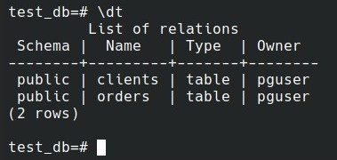
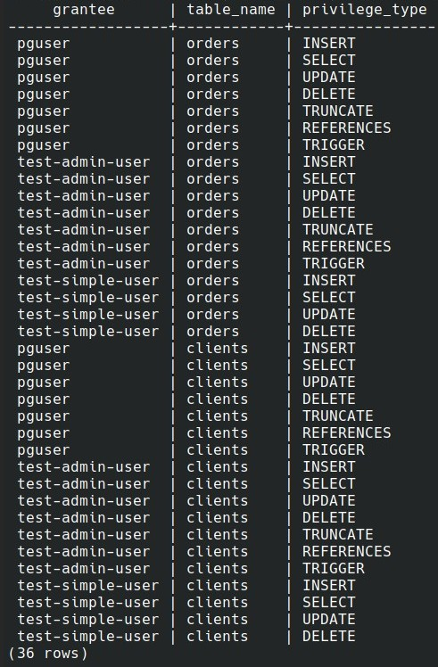

## 06-db-02-sql.
### ДЗ. "6.2. SQL".
---
# Домашнее задание к занятию 

## Задача 1

Используя docker поднимите инстанс PostgreSQL (версию 12) c 2 volume, 
в который будут складываться данные БД и бэкапы.

Приведите получившуюся команду или docker-compose манифест.
### Ответ:
```
~/netology/06-db-02-sql$ cat docker-compose.yaml 
version: '3.1'
services:
  postgres:
    image: postgres:12
    restart: always  
    environment:
      POSTGRES_DB: "pgdb"
      POSTGRES_USER: "pguser"
      POSTGRES_PASSWORD: "pgPass123"
      PGDATA: "/var/lib/postgresql/data/pgdata"
    volumes:
      - data:/var/lib/postgresql/data/pgdata
      - backup:/backup
    ports:
      - "5432:5432"    
    deploy:
      resources:
        limits:
          cpus: '1'
          memory: 2G
volumes:
  data: {}
  backup: {}           
```
---
## Задача 2

В БД из задачи 1: 
- создайте пользователя test-admin-user и БД test_db
- в БД test_db создайте таблицу orders и clients (спeцификация таблиц ниже)
- предоставьте привилегии на все операции пользователю test-admin-user на таблицы БД test_db
- создайте пользователя test-simple-user  
- предоставьте пользователю test-simple-user права на SELECT/INSERT/UPDATE/DELETE данных таблиц БД test_db

Таблица orders:
- id (serial primary key)
- наименование (string)
- цена (integer)

Таблица clients:
- id (serial primary key)
- фамилия (string)
- страна проживания (string, index)
- заказ (foreign key orders)

Приведите:
- итоговый список БД после выполнения пунктов выше,
- описание таблиц (describe)
- SQL-запрос для выдачи списка пользователей с правами над таблицами test_db
- список пользователей с правами над таблицами test_db

### Ответ:
**Итоговый список БД**:
``test_db=# \l``
<p align="left">
  
</p>
 
**Описание таблиц**:
``test_db=# \dt``
<p align="left">
  
</p>

**SQL-запрос для выдачи списка пользователей с правами над таблицами test_db**: 

``SELECT table_name, grantee, privilege_type FROM information_schema.role_table_grants WHERE table_name in ('clients', 'orders');`` 

**Cписок пользователей с правами над таблицами test_db**:

<p align="left">
  
</p>

 
---
## Задача 3

Используя SQL синтаксис - наполните таблицы следующими тестовыми данными:

Таблица orders

|Наименование|цена|
|------------|----|
|Шоколад| 10 |
|Принтер| 3000 |
|Книга| 500 |
|Монитор| 7000|
|Гитара| 4000|

Таблица clients

|ФИО|Страна проживания|
|------------|----|
|Иванов Иван Иванович| USA |
|Петров Петр Петрович| Canada |
|Иоганн Себастьян Бах| Japan |
|Ронни Джеймс Дио| Russia|
|Ritchie Blackmore| Russia|

Используя SQL синтаксис:
- вычислите количество записей для каждой таблицы 
- приведите в ответе:
    - запросы 
    - результаты их выполнения.

### Ответ:
**количество записей для каждой таблицы:**
```  
test_db=# SELECT count(*) FROM "orders";
 count 
-------
     5
(1 row)

test_db=# SELECT count(*) FROM "clients";
 count 
-------
     5
(1 row)
```
**Запрос на заполнение таблицы orders:**
```
test_db=# INSERT INTO orders ("наименование", "цена") VALUES ('Шоколад', 10), ('Принтер', 3000), ('Книга', 500), ('Монитор', 7000), ('Гитара', 4000);
test_db=# SELECT * FROM "orders";
 id | наименование | цена 
----+--------------------------+----------
  1 | Шоколад           |       10
  2 | Принтер           |     3000
  3 | Книга               |      500
  4 | Монитор           |     7000
  5 | Гитара             |     4000
(5 rows)
```
**Запрос на заполнение таблицы clients:**
```
test_db=# INSERT INTO clients ("фамилия", "страна проживания") VALUES ('Иванов Иван Иванович', 'USA'),
                                                           ('Петров Петр Петрович', 'Canada'),
                                                           ('Иоганн Себастьян Бах', 'Japan'),
                                                           ('Ронни Джеймс Дио', 'Russia'),
                                                           ('Ritchie Blackmore', 'Russia');
test_db=# SELECT * FROM "clients";
 id |             фамилия             | страна проживания | заказ 
----+----------------------------------------+-----------------------------------+------------
  1 | Иванов Иван Иванович | USA                               |           
  2 | Петров Петр Петрович | Canada                            |           
  3 | Иоганн Себастьян Бах | Japan                             |           
  4 | Ронни Джеймс Дио         | Russia                            |           
  5 | Ritchie Blackmore                      | Russia                            |           
(5 rows)                                                       
```
---
## Задача 4

Часть пользователей из таблицы clients решили оформить заказы из таблицы orders.

Используя foreign keys свяжите записи из таблиц, согласно таблице:

|ФИО|Заказ|
|------------|----|
|Иванов Иван Иванович| Книга |
|Петров Петр Петрович| Монитор |
|Иоганн Себастьян Бах| Гитара |

Приведите SQL-запросы для выполнения данных операций.

Приведите SQL-запрос для выдачи всех пользователей, которые совершили заказ, а также вывод данного запроса.
 
Подсказк - используйте директиву `UPDATE`.

### Ответ:
```
UPDATE clients SET заказ = 3 WHERE id = 1;
UPDATE clients SET заказ = 4 WHERE id = 2;
UPDATE clients SET заказ = 5 WHERE id = 3;

test_db=# SELECT * FROM clients c WHERE заказ is not null;
 id |             фамилия             | страна проживания | заказ 
----+----------------------------------------+-----------------------------------+------------
  1 | Иванов Иван Иванович | USA                               |          3
  2 | Петров Петр Петрович | Canada                            |          4
  3 | Иоганн Себастьян Бах | Japan                             |          5
(3 rows)
```
---
## Задача 5

Получите полную информацию по выполнению запроса выдачи всех пользователей из задачи 4 
(используя директиву EXPLAIN).

Приведите получившийся результат и объясните что значат полученные значения.

### Ответ:

```
test_db=# ANALYZE orders;
ANALYZE
test_db=# ANALYZE clients;
ANALYZE
test_db=# EXPLAIN SELECT * FROM clients c WHERE заказ is not null;
                        QUERY PLAN                        
----------------------------------------------------------
 Seq Scan on clients c  (cost=0.00..1.05 rows=3 width=47)
   Filter: ("заказ" IS NOT NULL)
(2 rows)
```
**Seq Scan** — последовательное чтение данных таблицы   
**cost** - Оценка затратности операции. Первое значение 0.00 — затраты на получение первой строки. Второе — 1.05 — затраты на получение всех строк.    
**rows**  — количество возвращаемых строк при выполнении операции   
**width** — средний размер одной строки в байтах.   
**Filter** - Применение фильтрации с условием   

---
## Задача 6

Создайте бэкап БД test_db и поместите его в volume, предназначенный для бэкапов (см. Задачу 1).

Остановите контейнер с PostgreSQL (но не удаляйте volumes).

Поднимите новый пустой контейнер с PostgreSQL.

Восстановите БД test_db в новом контейнере.

Приведите список операций, который вы применяли для бэкапа данных и восстановления. 

### Ответ:

---
