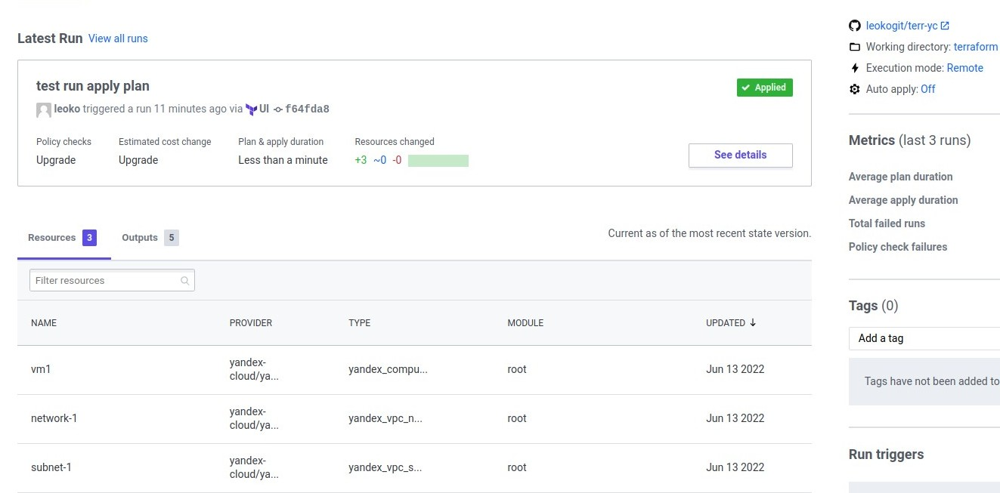

# Домашнее задание к занятию "7.4. Средства командной работы над инфраструктурой."

## Задача 1. Настроить terraform cloud (необязательно, но крайне желательно).
<details><summary>Спойлер,задачa 1</summary>
В это задании предлагается познакомиться со средством командой работы над инфраструктурой предоставляемым
разработчиками терраформа. 

1. Зарегистрируйтесь на [https://app.terraform.io/](https://app.terraform.io/).
(регистрация бесплатная и не требует использования платежных инструментов).
1. Создайте в своем github аккаунте (или другом хранилище репозиториев) отдельный репозиторий с
 конфигурационными файлами прошлых занятий (или воспользуйтесь любым простым конфигом).
1. Зарегистрируйте этот репозиторий в [https://app.terraform.io/](https://app.terraform.io/).
1. Выполните plan и apply. 
</details> 

В качестве результата задания приложите снимок экрана с успешным применением конфигурации.
### Ответ
Регистрация выполнена. Репозиторий зарегистрирован. Конфиг брал из предыдущего задания (создаётся одна машинка, сеть подсеть и вывод прямого и локального адреса и тп.), но пришлось внести изменеия - :

Так как в репозитории лучше не хранить файл с ключом - создал iam-токен для сервисного аккаунта yandex cloud (действует 12 часов) - записал его в качестве переменной в сам terraform.io (https://app.terraform.io/app/.../workspaces/test_app_terraform/variables) 

В main.tf Указал ssh ключ не в ввиде пути к файлу (~/.ssh/id_rsa.pub) а содержимое id_rsa.pub в переменную в variables.tf, но думаю, можно также записать в ввиде переменной в панели управления terraform.io и хранить эти значения удаленно. Если конечно это безопасно и можно так хранить конкретно эти данные. Для тестов подходит вариант.

Plan и apply выполнен успешно, ресурсы создались. после ресурсы уничтожил (plan destroy).   
<p align="center"> </p>

---
## Задача 2. Написать серверный конфиг для атлантиса. 
<details><summary>Спойлер, задача 2</summary>
Смысл задания – познакомиться с документацией 
о [серверной](https://www.runatlantis.io/docs/server-side-repo-config.html) конфигурации и конфигурации уровня 
 [репозитория](https://www.runatlantis.io/docs/repo-level-atlantis-yaml.html).

Создай `server.yaml` который скажет атлантису:
1. Укажите, что атлантис должен работать только для репозиториев в вашем github (или любом другом) аккаунте.
1. На стороне клиентского конфига разрешите изменять `workflow`, то есть для каждого репозитория можно 
будет указать свои дополнительные команды. 
1. В `workflow` используемом по-умолчанию сделайте так, что бы во время планирования не происходил `lock` состояния.

Создай `atlantis.yaml` который, если поместить в корень terraform проекта, скажет атлантису:
1. Надо запускать планирование и аплай для двух воркспейсов `stage` и `prod`.
1. Необходимо включить автопланирование при изменении любых файлов `*.tf`.
</details> 
 
В качестве результата приложите ссылку на файлы `server.yaml` и `atlantis.yaml`.
### Ответ
111:
``` 

```
---
## Задача 3. Знакомство с каталогом модулей. 
<details><summary>Спойлер, задача 3</summary>
1. В [каталоге модулей](https://registry.terraform.io/browse/modules) найдите официальный модуль от aws для создания
`ec2` инстансов. 
2. Изучите как устроен модуль. Задумайтесь, будете ли в своем проекте использовать этот модуль или непосредственно 
ресурс `aws_instance` без помощи модуля?
3. В рамках предпоследнего задания был создан ec2 при помощи ресурса `aws_instance`. 
Создайте аналогичный инстанс при помощи найденного модуля.   
</details> 

В качестве результата задания приложите ссылку на созданный блок конфигураций.

### Ответ
111:
``` 

```
---
