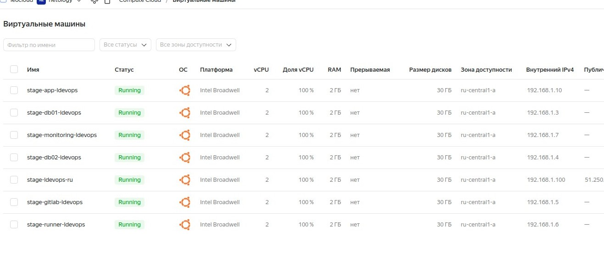

# Дипломный практикум в YandexCloud
## Цели:

1. Зарегистрировать доменное имя (любое на ваш выбор в любой доменной зоне).
2. Подготовить инфраструктуру с помощью Terraform на базе облачного провайдера YandexCloud.
3. Настроить внешний Reverse Proxy на основе Nginx и LetsEncrypt.
4. Настроить кластер MySQL.
5. Установить WordPress.
6. Развернуть Gitlab CE и Gitlab Runner.
7. Настроить CI/CD для автоматического развёртывания приложения.
8. Настроить мониторинг инфраструктуры с помощью стека: Prometheus, Alert Manager и Grafana.

---
## Этапы выполнения:

### 1. Регистрация доменного имени . Сделано

1. Есть доступ к личному кабинету на сайте регистратора. (Регистратор: [reg.ru](https://reg.ru))
2. Доменное имя зарегестрировано и могу им управлять (редактировать dns записи в рамках этого домена).

 

---
### 2. Создание инфраструктуры . Сделано

1. Создан сервисный аккаунт, который будет в дальнейшем использоваться Terraform для работы с инфраструктурой с необходимыми и достаточными правами.
2. Подготовлен backend для Terraform: S3 bucket в созданном YC аккаунте.   
3. Настроены два workspace: *stage* и *prod*. (В случае выбора stage или prod меняются объём выделяемых ресурсов (cpu , memory).  
4. Создана VPC с 3 подсетями в трёх зонах доступности (ru-central1-a, ru-central1-b, ru-central1-c).
5. Команды `terraform destroy` и `terraform apply` выполняются успешно, без дополнительных ручных действий.

+  Terraform сконфигурирован и создание инфраструктуры посредством Terraform возможно без дополнительных ручных действий.    
+  Terraform apply выполняется успешно, виртуальные машины создаются. Статический адрес создаётся и привязывается автоматом для машинки с требованием external address.     :

 

---
### 3. Настроить внешний Reverse Proxy на основе Nginx и LetsEncrypt . В процессе

+   Разработана Ansible роль для установки Nginx и LetsEncrypt.  В процессе 
+   Создан reverse proxy с поддержкой TLS для обеспечения безопасного доступа к веб-сервисам по HTTPS. В процессе 

результаты:В процессе

1. В доменной зоне настроены все A-записи на внешний адрес этого сервера:
    - `https://www.you.domain` (WordPress)
    - `https://gitlab.you.domain` (Gitlab)
    - `https://grafana.you.domain` (Grafana)
    - `https://prometheus.you.domain` (Prometheus)
    - `https://alertmanager.you.domain` (Alert Manager)
2. Настроены все upstream для выше указанных URL

---
### 4. Установка кластера MySQL . В процессе

+  Разработана Ansible роль для установки кластера MySQL. В процессе   
+  Получен отказоустойчивый кластер баз данных MySQL. В процессе   

результаты: В процессе

1. MySQL работает в режиме репликации Master/Slave.   
2. В кластере автоматически создаётся база данных c именем `wordpress`.   
3. В кластере автоматически создаётся пользователь `wordpress` с полными правами на базу `wordpress` и паролем `wordpress`.   
---
### 5. Установка WordPress . В процессе

+   Разработана Ansible роль для установки WordPress. В процессе

1. Установлен [WordPress](https://wordpress.org/download/).    В процессе 

результаты: В процессе

1. Виртуальная машина на которой установлен WordPress и Nginx/Apache .
2. В доменной зоне настроена A-запись на внешний адрес reverse proxy:
    - `https://www.you.domain` (WordPress)
3. На сервере `you.domain` отредактирован upstream для выше указанного URL и он смотрит на виртуальную машину на которой установлен WordPress.
4. В браузере можно открыть URL `https://www.you.domain` и увидеть главную страницу WordPress.
---
### 6. Настроить CI/CD для автоматического развёртывания приложения. (Установка Gitlab CE и Gitlab Runner) .  В процессе

+   Настроена CI/CD система для автоматического развертывания приложения при изменении кода.  В процессе   
+   Построен pipeline доставки кода в среду эксплуатации, то есть настроить автоматический деплой на сервер `app.you.domain` при коммите в репозиторий с WordPress.  В процессе  

результат: В процессе

1. Интерфейс Gitlab доступен по https.
2. В доменной зоне настроена A-запись на внешний адрес reverse proxy:
    - `https://gitlab.you.domain` (Gitlab)
3. На сервере `you.domain` отредактирован upstream для выше указанного URL и он смотрит на виртуальную машину на которой установлен Gitlab.
3. При любом коммите в репозиторий с WordPress и создании тега (например, v1.0.0) происходит деплой на виртуальную машину.
---
### 7. Настроить мониторинг инфраструктуры с помощью стека: Prometheus, Alert Manager и Grafana. В процессе

+   Разработана Ansible роль для установки Prometheus, Alert Manager и Grafana. В процессе        
+   Работает получение метрик со всей инфраструктуры. В процессе    

результаты: В процессе

1. Интерфейсы Prometheus, Alert Manager и Grafana доступены по https.
2. В доменной зоне настроены A-записи на внешний адрес reverse proxy:
  - `https://grafana.you.domain` (Grafana)
  - `https://prometheus.you.domain` (Prometheus)
  - `https://alertmanager.you.domain` (Alert Manager)
3. На сервере `you.domain` отредактированы upstreams для выше указанных URL и они смотрят на виртуальную машину на которой установлены Prometheus, Alert Manager и Grafana.
4. На всех серверах установлен Node Exporter и его метрики доступны Prometheus.
5. У Alert Manager есть необходимый [набор правил](https://awesome-prometheus-alerts.grep.to/rules.html) для создания алертов.
2. В Grafana есть дашборд отображающий метрики из Node Exporter по всем серверам.
3. В Grafana есть дашборд отображающий метрики из MySQL (*).
4. В Grafana есть дашборд отображающий метрики из WordPress (*).

---
## Итоговый результат, скриншоты сервисов и ссылки на конфиги  В процессе

1. Репозиторий со всеми Terraform манифестами и готовность продемонстрировать создание всех ресурсов с нуля.
2. Репозиторий со всеми Ansible ролями и готовность продемонстрировать установку всех сервисов с нуля.
3. Скриншоты веб-интерфейсов всех сервисов работающих по HTTPS на вашем доменном имени.
  - `https://www.you.domain` (WordPress)
  - `https://gitlab.you.domain` (Gitlab)
  - `https://grafana.you.domain` (Grafana)
  - `https://prometheus.you.domain` (Prometheus)
  - `https://alertmanager.you.domain` (Alert Manager)
  
---
