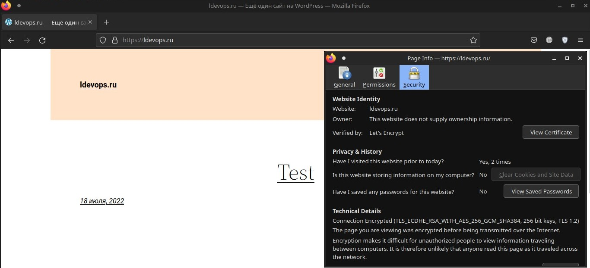
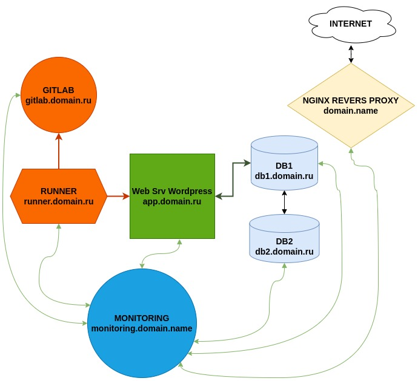

# Дипломный практикум в YandexCloud
## Цели:

1. Зарегистрировать доменное имя (любое на ваш выбор в любой доменной зоне).
2. Подготовить инфраструктуру с помощью Terraform на базе облачного провайдера YandexCloud.
3. Настроить внешний Reverse Proxy на основе Nginx и LetsEncrypt.
4. Настроить кластер MySQL.
5. Установить WordPress.
6. Развернуть Gitlab CE и Gitlab Runner.
7. Настроить CI/CD для автоматического развёртывания приложения.
8. Настроить мониторинг инфраструктуры с помощью стека: Prometheus, Alert Manager и Grafana.

---
## Этапы выполнения:

### 1. Регистрация доменного имени . Сделано

1. Есть доступ к личному кабинету на сайте регистратора. (Регистратор: [reg.ru](https://reg.ru))
2. Доменное имя зарегестрировано и могу им управлять (редактировать dns записи в рамках этого домена).
3. Заранее добавил cname записи для всех сервисов, чтобы постоянно не редактировать ip (если он будет изменяться)

<p align="center"> </p>

---
### 2. Создание инфраструктуры . Сделано

1. Создан сервисный аккаунт, который будет в дальнейшем использоваться Terraform для работы с инфраструктурой с необходимыми и достаточными правами.
2. Подготовлен backend для Terraform: S3 bucket в созданном YC аккаунте.   
3. Настроены два workspace: *stage* и *prod*. (В случае выбора stage или prod меняются объём выделяемых ресурсов (cpu , memory).  
4. Создана VPC с 3 подсетями в трёх зонах доступности (ru-central1-a, ru-central1-b, ru-central1-c).
5. Команды `terraform destroy` и `terraform apply` выполняются успешно, без дополнительных ручных действий.

+  Terraform сконфигурирован и создание инфраструктуры посредством Terraform возможно без дополнительных ручных действий.    
+  Terraform apply выполняется успешно, виртуальные машины создаются. Статический адрес создаётся и привязывается автоматом для машинки с требованием external address.     :

<p align="center"> </p>

Terraform создаёт все необходимые ресурсы для дальнейшей работы : 
+  сеть,подсети в разных зонах доступности, создаётся таблица маршрутизации (для выхода в интернет с локальных адресов через nat instance) и автоматом привязывается к подсети. 
+ Vm1. Для nginx revers proxy (он же будет и в роли nat instance для других машинок) , к этой машинее привязывается заранее зарезервированный публичный ip адрес (для того чтобы не изменять постоянно записи для dns), также предусмотрена возможность автоматом резервировать новый внешиний адрес ip и привязывать его (в конфиге эти возможности закомментированы). 
+ Vm2 для БД сервера 1
+ Vm3 для БД сервера 2
+ Vm4 для WordPress
+ Vm5 для Gitlab CE
+ Vm6 для Gitlab Runner
+ Vm7 для Мониторинга
---
### 3. Настроить внешний Reverse Proxy на основе Nginx и LetsEncrypt . Сделано

+   Разработана Ansible роль для установки Nginx и LetsEncrypt.  Сделано 
+   Создан reverse proxy с поддержкой TLS для обеспечения безопасного доступа к веб-сервисам по HTTPS. Сделано 

результаты:Сделано

1. В доменной зоне настроены все A-записи на внешний адрес этого сервера:
    - `https://www.you.domain` (WordPress)
    - `https://gitlab.you.domain` (Gitlab)
    - `https://grafana.you.domain` (Grafana)
    - `https://prometheus.you.domain` (Prometheus)
    - `https://alertmanager.you.domain` (Alert Manager)
2. Настроены все upstream для выше указанных URL

Описание действий Ansible роли :
+  Обновляется система
+  Настраивается nat iptables для возможности выхода в интернет остальным хостам без публичного адреса, из локальной сети, через эту машину
+  Устанавливливается и настраивается nginx на работу в качестве reverse proxy, добавляются upstreams и копируются конфиг файлы
+  Устанавливается certbot для генерации сертификатов Let's encrypt , генерируются сертификаты, автообновление добавляется добавляется в Cron    

В итоге: Все машинки с локальными ip могут ходить в интернет через nginx reveresproxy (он же используется и как nat instance) Проксирование работает,
другие ansible роли запускаются без проблем на хостах указанными в ввиде dns имени (например db01.domainname.ru), ssh подключение через прокси (nginx reverse proxy). Через браузер можно зайти на `https://www.you.domain` (WordPress) открывается нужный сайт ( app.mydomain.ru где будет worpress ) ошибок сертификата нет. 

``` 
curl -vI https://app.ldevops.ru

```
---
### 4. Установка кластера MySQL . Сделано

+  Разработана Ansible роль для установки кластера MySQL. Сделано  
+  Получен отказоустойчивый кластер баз данных MySQL. Сделано

результаты: Сделано

1. MySQL работает в режиме репликации Master/Slave.   
2. В кластере автоматически создаётся база данных c именем `wordpress`.   
3. В кластере автоматически создаётся пользователь `wordpress` с полными правами на базу `wordpress` и паролем `wordpress`.   

Итог выполнения: 

База и пользователи (сам wordpress и пользователь для репликации) с нужными привелегиями созданы
MySQL работает в режиме репликации Master/Slave. :
Статус на мастере: 
```
mysql> SHOW MASTER STATUS\G
*************************** 1. row ***************************
             File: mysql-bin.000001
         Position: 157
     Binlog_Do_DB: wordpress
 Binlog_Ignore_DB: 
Executed_Gtid_Set: 
1 row in set (0.00 sec)

```
Статус на слейве:
```
mysql> SHOW SLAVE STATUS\G
*************************** 1. row ***************************
               Slave_IO_State: 
                  Master_Host: db01.ldevops.ru
                  Master_User: repl
                  Master_Port: 3306
                Connect_Retry: 60
              Master_Log_File: mysql-bin.000001
          Read_Master_Log_Pos: 157
               Relay_Log_File: db02-relay-bin.000001
                Relay_Log_Pos: 4
        Relay_Master_Log_File: mysql-bin.000001
             Slave_IO_Running: No
            Slave_SQL_Running: No
              Replicate_Do_DB: 
          Replicate_Ignore_DB: 
           Replicate_Do_Table: 
       Replicate_Ignore_Table: 
      Replicate_Wild_Do_Table: 
  Replicate_Wild_Ignore_Table: 
                   Last_Errno: 0
                   Last_Error: 
                 Skip_Counter: 0
          Exec_Master_Log_Pos: 157
              Relay_Log_Space: 0
              Until_Condition: None
               Until_Log_File: 
                Until_Log_Pos: 0
           Master_SSL_Allowed: No
           Master_SSL_CA_File: 
           Master_SSL_CA_Path: 
              Master_SSL_Cert: 
            Master_SSL_Cipher: 
               Master_SSL_Key: 
        Seconds_Behind_Master: NULL
Master_SSL_Verify_Server_Cert: No
                Last_IO_Errno: 0
                Last_IO_Error: 
               Last_SQL_Errno: 0
               Last_SQL_Error: 
  Replicate_Ignore_Server_Ids: 
             Master_Server_Id: 0
                  Master_UUID: 
             Master_Info_File: mysql.slave_master_info
                    SQL_Delay: 0
          SQL_Remaining_Delay: NULL
      Slave_SQL_Running_State: 
           Master_Retry_Count: 86400
                  Master_Bind: 
      Last_IO_Error_Timestamp: 
     Last_SQL_Error_Timestamp: 
               Master_SSL_Crl: 
           Master_SSL_Crlpath: 
           Retrieved_Gtid_Set: 
            Executed_Gtid_Set: 
                Auto_Position: 0
         Replicate_Rewrite_DB: 
                 Channel_Name: 
           Master_TLS_Version: 
       Master_public_key_path: 
        Get_master_public_key: 0
            Network_Namespace: 
1 row in set, 1 warning (0.00 sec)
```
---
### 5. Установка WordPress . Сделано

+   Разработана Ansible роль для установки WordPress. Сделано

1. Установлен [WordPress](https://wordpress.org/download/).    Сделано 

результаты: В процессе

1. Виртуальная машина на которой установлен WordPress и Nginx/Apache .
2. В доменной зоне настроена A-запись на внешний адрес reverse proxy:
    - `https://www.you.domain` (WordPress)
3. На сервере `you.domain` отредактирован upstream для выше указанного URL и он смотрит на виртуальную машину на которой установлен WordPress.
4. В браузере можно открыть URL `https://www.you.domain` и увидеть главную страницу WordPress.

Резульаты: 
+  Создана ansible роль для установки Nginx + php-fpm + Wordpress
+  Wordpress успешно подключается к базе данных (db01.domain_name.ru), нет ошибок nginx и самого wordpress (debug), после прогона роли можно зайти на сайт (db01.domain_name.ru) откроется первичная настройка wordpress (выбор языка, создание пользователя wordpress) , ошибок сертификата нет.

<p align="center"> </p>

---
### 6. Настроить CI/CD для автоматического развёртывания приложения. (Установка Gitlab CE и Gitlab Runner) .  В процессе

+   Настроена CI/CD система для автоматического развертывания приложения при изменении кода.  В процессе   
+   Построен pipeline доставки кода в среду эксплуатации, то есть настроить автоматический деплой на сервер `app.you.domain` при коммите в репозиторий с WordPress.  В процессе  

результат: В процессе

1. Интерфейс Gitlab доступен по https.
2. В доменной зоне настроена A-запись на внешний адрес reverse proxy:
    - `https://gitlab.you.domain` (Gitlab)
3. На сервере `you.domain` отредактирован upstream для выше указанного URL и он смотрит на виртуальную машину на которой установлен Gitlab.
3. При любом коммите в репозиторий с WordPress и создании тега (например, v1.0.0) происходит деплой на виртуальную машину.
---
### 7. Настроить мониторинг инфраструктуры с помощью стека: Prometheus, Alert Manager и Grafana. В процессе

+   Разработана Ansible роль для установки Prometheus, Alert Manager и Grafana. В процессе        
+   Работает получение метрик со всей инфраструктуры. В процессе    

результаты: В процессе

1. Интерфейсы Prometheus, Alert Manager и Grafana доступены по https.
2. В доменной зоне настроены A-записи на внешний адрес reverse proxy:
  - `https://grafana.you.domain` (Grafana)
  - `https://prometheus.you.domain` (Prometheus)
  - `https://alertmanager.you.domain` (Alert Manager)
3. На сервере `you.domain` отредактированы upstreams для выше указанных URL и они смотрят на виртуальную машину на которой установлены Prometheus, Alert Manager и Grafana.
4. На всех серверах установлен Node Exporter и его метрики доступны Prometheus.
5. У Alert Manager есть необходимый [набор правил](https://awesome-prometheus-alerts.grep.to/rules.html) для создания алертов.
2. В Grafana есть дашборд отображающий метрики из Node Exporter по всем серверам.
3. В Grafana есть дашборд отображающий метрики из MySQL (*).
4. В Grafana есть дашборд отображающий метрики из WordPress (*).

---
## Итоговый результат, скриншоты сервисов и ссылки на конфиги  В процессе

1. Репозиторий со всеми Terraform манифестами и готовность продемонстрировать создание всех ресурсов с нуля.
2. Репозиторий со всеми Ansible ролями и готовность продемонстрировать установку всех сервисов с нуля.
3. Скриншоты веб-интерфейсов всех сервисов работающих по HTTPS на вашем доменном имени.
  - `https://www.you.domain` (WordPress)
  - `https://gitlab.you.domain` (Gitlab)
  - `https://grafana.you.domain` (Grafana)
  - `https://prometheus.you.domain` (Prometheus)
  - `https://alertmanager.you.domain` (Alert Manager)

Результаты: 

Итоговая схема инфраструктуры: 
<p align="center"> </p>

---
